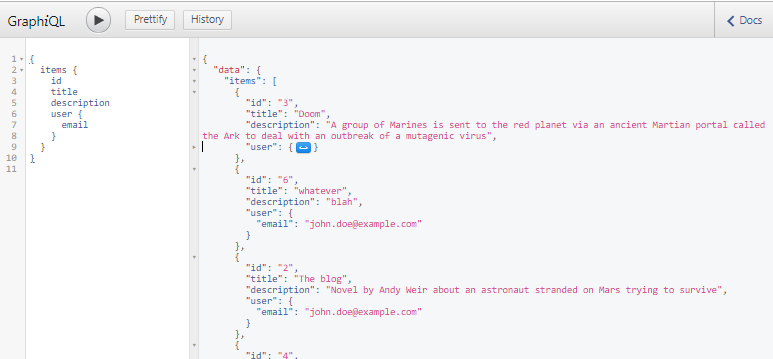

README
------

**Based on a three-part tutorial by Evil Martians**
- https://evilmartians.com/chronicles/graphql-on-rails-1-from-zero-to-the-first-query
- https://evilmartians.com/chronicles/graphql-on-rails-2-updating-the-data
- https://evilmartians.com/chronicles/graphql-on-rails-3-on-the-way-to-perfection

**Using Rails 6.0.0.rc1 (incl ActionCable), GraphQL, Apollo, React 16.3+**

**Extended to include delete functionality**

*Note Apollo now uses `useQuery` and `useMutation` hooks*
___

## GraphQL

- avoids over-/underfetching
- strongly-typed schemas
- schema introspection

**Fragments:**
-GraphQL's 'variables' -> a named set of fields on a specific type.

Example:

*From: https://www.apollographql.com/docs/react/data/fragments/*

```javascript
fragment NameParts on Person {
  firstName
  lastName
}

query GetPerson {
  people(id: "7") {
    ...NameParts
    avatar(size: LARGE)
  }
}
```

---

### Notes for self:

` bundle add graphql --version="~> 1.9"`
`rails g graphql:install`

- a query represents a sub-graph of the schema
- a GraphQL server must guarantee mutations executed consecutively, whereas queries can be executed in parallel.
- variables begin with $
- requires QueryType in Types Module, inheriting from Types::BaseObject  `query_type.rb` (mutation and subscription types are optional) - defined via `rails g graphql:object name_of_type`
- requests handled by GraphqlController#execute action (parses query, detects types, resolves requested fields)

___

 GraphiQL web interface provided by mounting: (available at http://localhost:3000/graphiql)

 ```ruby
 # config/routes.rb
Rails.application.routes.draw do
  mount GraphiQL::Rails::Engine, at: "/graphiql", graphql_path: "/graphql" if Rails.env.development?
  post "/graphql", to: "graphql#execute"
end
```



___

## Apollo

Read more: https://www.apollographql.com

- declarative approach to data-fetching
- single Query component encapsulates logic for retrieving data/loading/errors/updating UI
- normalised cache
> Since you can have multiple paths leading to the same data, normalisation is essential for keeping your data consistent across multiple components
_https://www.apollographql.com_
- handles remote AND local data (e.g. global flags, API results) -> `apollo-link-state` for local state-management -> Apollo cache as single source of truth for app's data -> makes GraphQL into unified interface to ALL data (queryable through GraphiQL)

Apollo config in `utils/apollo.js` or `apollo.config.js`

### Installation:

`yarn add apollo-client apollo-cache-inmemory apollo-link-http apollo-link-error apollo-link graphql graphql-tag react-apollo`
(or `yarn add apollo-boost react-apollo graphql` = `apollo-boost` contains the apollo basics!)

### Packages:

- `apollo-client` = perform and cache graphQL requests
- `apollo-cache-inmemory` = storage implementation for Apollo cache (for Apollo Client 2.0) -> `InMemoryCache` as normalised data store (splits data into individual objects w unique identifiers - `id` or `_id` & `__typename`, stored in flattened data structure)
- `apollo-link` = middleware pattern for apollo-client operations

> Apollo Link is a standard interface for modifying control flow of GraphQL requests and fetching GraphQL results. In a few words, Apollo Links are chainable "units" that you can snap together to define how each GraphQL request is handled by your GraphQL client. When you fire a GraphQL request, each Link's functionality is applied one after another. This allows you to control the request lifecycle in a way that makes sense for your application. For example, Links can provide retrying, polling, batching, and more! - From https://www.apollographql.com/docs/link/

- `apollo-link-http` - the most common Apollo link - a terminating link that fetches GraphQL results from a GraphQL endpoint over a http connection (supports auth, persisted queries, dynamic uris etc)
- `apollo-link-error` - callback with `onError` (opts: operation, response, GraphQLErrors, networkError, forward - to next link in chain) https://github.com/apollographql/apollo-link/tree/master/packages/apollo-link-error
- `graphql-tag` = build queries - helpful utilities for parsing GraphQL queries (incl `gqp` - a JavaScript template literal tag that parses GraphQL query strings into the standard GraphlQL AST & `/loader` - a webpack loader to preprocess queries) https://github.com/apollographql/graphql-tag
- `react-apollo` = displaying data (view layer integration for React)

#### Initialise cache & pass to ApolloClient:

```javascript
// utils/apollo.js
import { InMemoryCache } from 'apollo-cache-inmemory';
import { HttpLink } from 'apollo-link-http';
import { ApolloClient } from 'apollo-client';

const cache = new InMemoryCache();

const client = new ApolloClient({
  link: new HttpLink(),
  cache
});
```

### Wrap App in Provider HOC

```javascript
// app/javascript/packs/index.js
import React from "react";
import { render } from "react-dom";
import { ApolloProvider } from "react-apollo";

const App = () => (
  <ApolloProvider client={client}>
    <div>
      <h2>App Content</h2>
    </div>
  </ApolloProvider>
);

render(<App />, document.getElementById("root"));
```

### Apollo Query component

```javascript
<Query></Query>
```

*Example:*

*From https://www.apollographql.com/docs/react/data/queries/*

```javascript
const GET_DOG_PHOTO = gql`
  query Dog($breed: String!) {
    dog(breed: $breed) {
      id
      displayImage
    }
  }
`;

function DogPhoto({ breed }) {
  const { loading, error, data } = useQuery(GET_DOG_PHOTO, {
    variables: { breed },
  });

  if (loading) return null;
  if (error) return `Error! ${error}`;

  return (
    
  );
}
```

- query first tries to load from Apollo cache and if not there, sends request to 'server'
- query subscribes to the result = updates reactively
- fresh data? via polling/refetching - e.g. `startPolling` and `stopPolling` functions on the result object passed to render prop function or refetch function (e.g. triggered by a button click - no need to pass in vars, uses the ones from the previous query
-`networkStatus` + `notifyNetworkStatusChange` - info about status of query, useful re: refetch/polling
-`networkStatus` property is an enum w number values 1-8 representing loading state.

___

### Apollo Mutation component

```javascript
<Mutation></Mutation>
```

Apollo Mutation component triggers mutations from UI:

- pass a GraphQL mutation string wrapped with the `gql` function to `this.props.mutation` & provide a function to `this.props.children` telling React what to render.
- mutate function optionally takes variables, `optimisticResponse`, `refetchQueries`, & `update` (or pass into component as props)
- 2nd arg in render prop fn is object w mutation result on the `data` property, `loading`, `error`, `called` booleans
- If you'd like to ignore the result of the mutation, pass `ignoreResults` as a prop to the mutation component.

#### update function

- called w Apollo cache as 1st arg. Several utility functions e.g. `cache.readQuery` & `cache.writeQuery` allow you to read/write queries to cache w GraphQL **as if it were a server**.
- 2nd arg to the update function is object w data property containing mutation result.

>If you specify an optimistic response, your update function will be called twice: once with your optimistic result, and another time with your actual result. You can use your mutation result to update the cache with `cache.writeQuery`.

*Example:*

```javascript
const GET_TODOS = gql`
  query GetTodos {
    todos
  }
`;

const AddTodo = () => {
  let input;

  return (
    <Mutation
      mutation={ADD_TODO}
      update={(cache, { data: { addTodo } }) => {
        const { todos } = cache.readQuery({ query: GET_TODOS });
        cache.writeQuery({
          query: GET_TODOS,
          data: { todos: todos.concat([addTodo]) },
        });
      }}
    >
      {addTodo => (
        <div>
          <form
            onSubmit={e => {
              e.preventDefault();
              addTodo({ variables: { type: input.value } });
              input.value = "";
            }}
          >
            <input
              ref={node => {
                input = node;
              }}
            />
            <button type="submit">Add Todo</button>
          </form>
        </div>
      )}
    </Mutation>
  );
};
```

### Note:

- Not every mutation requires an update function, e.g. if updating a single item

#### WHY?

Apollo's normalised cache splits out each object with an id into its own entity
=> generates a key `${object__typename}:${objectId}` for each entity that has `__typename` and `id` => after mutation apollo finds it in cache & makes changes/rerenders components

___

### ActionCable

Subscription in this repo is based on Evil Martians' solution. Another option would be: https://www.apollographql.com/docs/react/advanced/subscriptions/

### React Component Folders with GraphQL:

- javascript/components/Name/
-- index.js
-- operations.graphql
-- styles.module.css

### RSpec setup:

```bash
bundle add rspec-rails --version="4.0.0.beta2" --group="development,test"
rails generate rspec:install
bundle add factory_bot_rails --version="~> 5.0" --group="development,test"
```

Add `config.include FactoryBot::Syntax::Methods` to `rails_helper.rb`

```ruby
# spec/factories.rb
FactoryBot.define do
  factory :user do
    # Use sequence to make sure that the value is unique
    sequence(:email) { |n| "user-#{n}@example.com" }
  end

  factory :item do
    sequence(:title) { |n| "item-#{n}" }
    user
  end
end

# spec/graphql/types/query_type_spec.rb
require "rails_helper"

RSpec.describe Types::QueryType do
  describe "items" do
    let!(:items) { create_pair(:item) }

    let(:query) do
      %(query {
        items {
          title
        }
      })
    end

    subject(:result) do
      MartianLibrarySchema.execute(query).as_json
    end

    it "returns all items" do
      expect(result.dig("data", "items")).to match_array(
        items.map { |item| { "title" => item.title } }
      )
    end
  end
end
```